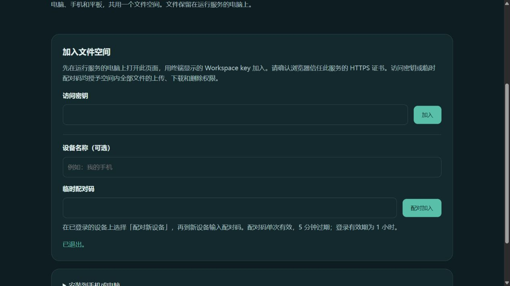
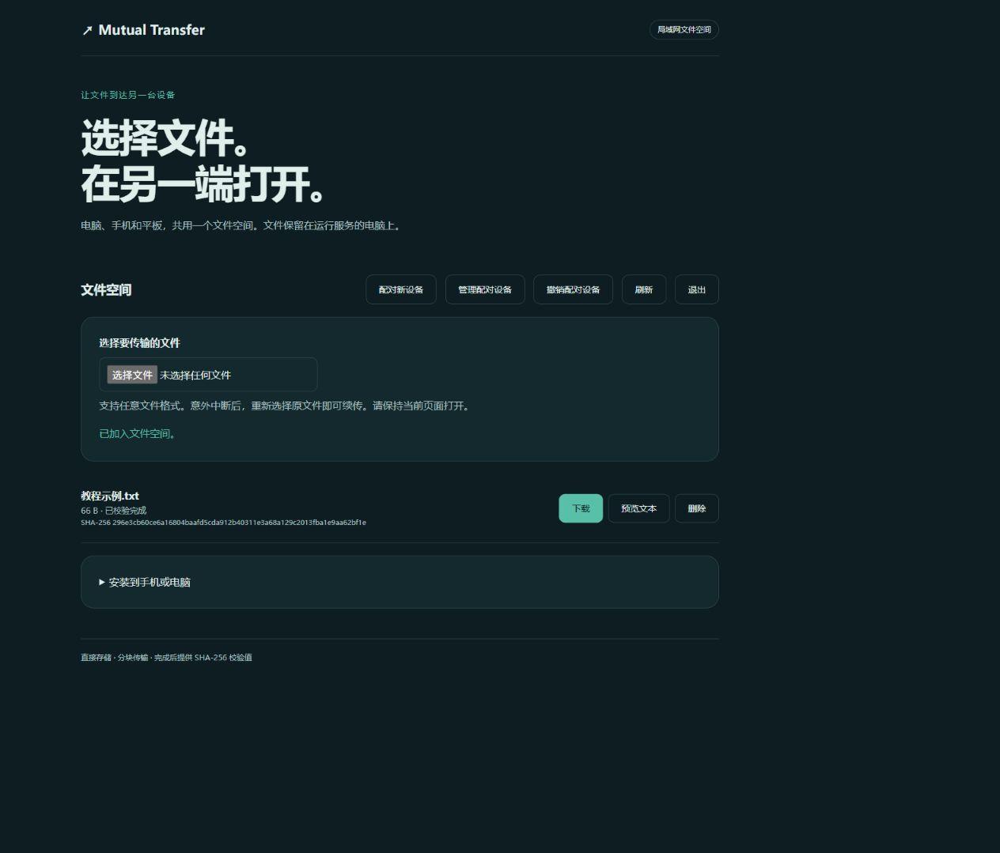
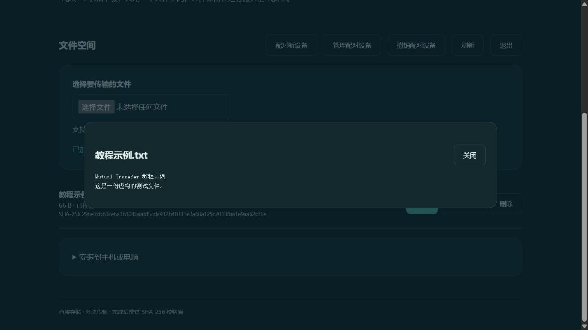
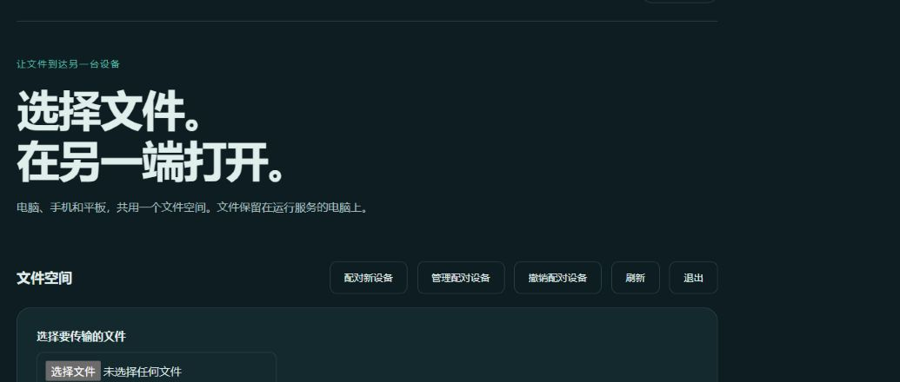

# Mutual Transfer 使用教程

Mutual Transfer 把文件暂存在运行服务的电脑上。加入同一文件空间的设备都能上传、下载和删除这些文件。下面的截图来自实际运行的浏览器界面，示例文件为虚构内容。

## 1. 在电脑上启动服务

有 Windows 免安装包时，下载同一次成功构建中的 ZIP 和 `.sha256`，核对 SHA-256 后解压完整文件夹，双击 `START-WINDOWS.cmd`。保持弹出的终端窗口打开。包的获取方式和数据目录见 [Windows 免安装包说明](WINDOWS-PORTABLE.md)。它是预览构建，目前没有稳定版安装包。

从源码运行时，先安装 Node.js 22 或更新版本，然后在项目目录执行：

```sh
npm ci --ignore-scripts
npm start
```

终端会显示本机地址和 `Workspace key`。在同一台电脑上打开 `http://127.0.0.1:8787`，输入该密钥，点击「加入」。请不要把终端截图或密钥发给无关人员。默认密钥在服务重启后变化；已经上传的文件仍留在数据目录。



## 2. 上传和下载

点击「选择要传输的文件」挑选文件，等待源文件校验和上传完成。文件行显示「已校验完成」后，其他已加入的设备点击「刷新」就能看到它，再点击「下载」。完成文件也可预览；删除会让所有设备失去从此空间下载它的能力。



文本、图片和浏览器支持的视频可点击「预览」或「预览文本」查看。其他格式直接下载后用本机应用打开。



如果传输中断，保持原文件不变，重新选择它即可从已保存的断点继续。手机浏览器传输时保持页面在前台；下载尚不支持断点续传。SHA-256 校验表示收到的内容与上传源文件一致，不表示文件安全无毒。

## 3. 让另一台设备加入

跨设备访问前，服务电脑必须拥有与访问地址匹配、且在另一台设备上受信任的 HTTPS 证书。按 [HTTPS 配置](HTTPS.md) 设置 `HOST`、`TLS_CERT`、`TLS_KEY`，自定义域名时再设置 `ALLOWED_HOSTS`。只开放所需的局域网端口。不要绕过证书警告，也不要把服务暴露到公网。

在新设备上打开同一个 HTTPS 地址。在已登录的电脑上点击「配对新设备」，将临时配对码输入新设备的「临时配对码」栏。配对码只能用一次，5 分钟过期。新设备会话有效 1 小时；需要继续使用时再登录。配对成员拥有空间内全部文件的上传、下载和删除权限，所以只邀请可信的人和设备。



不再需要某台设备访问时，在持有 Workspace key 的设备上打开「管理配对设备」，核对会话编号并撤销对应会话；也可以「撤销配对设备」清除全部配对会话。撤销不能收回对方已经下载的副本，已经开始的请求也可能完成。详细规则见 [配对与撤销](PAIRING.md)。

## 常见问题

| 提示或现象 | 处理办法 |
| --- | --- |
| 访问密钥不正确 | 核对当前服务终端中的 Workspace key；重启后自动密钥会变化。 |
| 配对码无效、已过期或已使用 | 在已登录设备上重新生成，5 分钟内在新设备输入。 |
| 无法连接文件空间 | 确认服务电脑仍在运行，地址、端口和局域网连接正确；HTTPS 还需检查证书信任和地址匹配。 |
| 文件空间已满 | 删除不再需要的文件，或由服务电脑管理员调整容量与存储位置。 |
| 上传中断 | 重新选择内容未变化的原文件；不要先删除未完成的文件行。 |
| 手机打开页面后传输停止 | 返回前台并重新选择原文件；后台和锁屏传输尚无保证。 |

服务默认是单一共享空间，所有成员看到同一批文件。文件保存在服务电脑，不会因为关闭浏览器而自动删除；关闭服务终端会停止访问。[Android 客户端](ANDROID.md)仍是开发预览，需单独安装并配置可信 HTTPS 服务。
